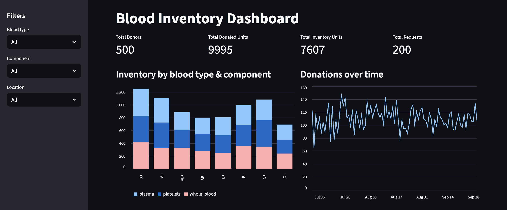

# Blood Inventory ETL & Dashboard



## Project Overview

This project is a **data engineering and visualization pipeline** for blood inventory management. It simulates blood donations, hospital requests, and inventory, then processes the data via an ETL pipeline and displays an interactive **Streamlit dashboard**.

Key features:

* Generate mock blood donation and request data (donors, donations, hospital requests, inventory).
* Clean, transform, and load data into **SQLite** database.
* Interactive Streamlit dashboard:

    - View inventory by **blood type** and **component** (plasma, platelets, whole blood).
    - Track **donations over time**.
    - Visualize **hospital request status**.
    - See **low stock alerts**.
    - Filter by blood type, component, and location.
    - KPIs for total donors, donated units, inventory, and requests.

---

## Project Structure

```
Blood Inventory ETL & Dashboard/
│
├─ src/
│  ├─ data_gen.py        # Generates mock blood donation and request data
│  ├─ etl_loader.py      # Cleans and loads data into SQLite
│  ├─ dashboard.py       # Streamlit dashboard to visualize the data
│  └─ data/              # Folder for generated CSV files
│
├─ screenshot.png        # Dashboard screenshot
└─ README.md
```

---

## Installation

1. Clone the repository:

```
git clone https://github.com/bakliwalvaibhav1/Blood-Inventory-ETL-Dashboard.git
cd Blood-Inventory-ETL-Dashboard
```

2. Create a virtual environment (optional but recommended):

```
python -m venv venv
source venv/bin/activate       # Linux/Mac
venv\Scripts\activate          # Windows
```

3. Install dependencies:

```
pip install -r requirements.txt
```

---

## Usage

1. Generate mock data:

```
python src/data_gen.py
```

2. Load data into SQLite:

```
python src/etl_loader.py
```

3. Run the dashboard:

```
streamlit run dashboard.py
```

* Use the sidebar to filter by **blood type**, **component**, or **location**.
* View KPIs, inventory charts, donations over time, and request status.

---

## Technologies Used

* Python 3.x
* Pandas
* Streamlit
* SQLite

---

## Notes

* The data is **mock-generated** for demonstration purposes.
* Inventory is calculated from donations minus fulfilled requests.
* Supports three blood components: **plasma, platelets, and whole blood**.
